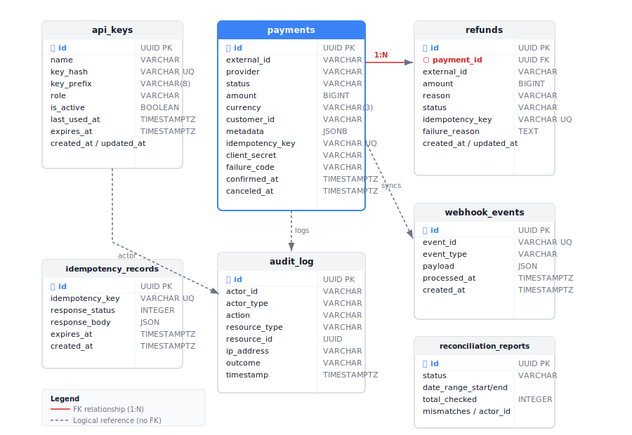

# Data Model

All tables use UUIDs as primary keys and `created_at` / `updated_at` timestamps (UTC).

## Entity Relationship Diagram



---

## payments

Core table. One row per payment intent.

| Column | Type | Description |
|--------|------|-------------|
| `id` | UUID PK | Internal payment identifier |
| `external_id` | VARCHAR(255) | Stripe PaymentIntent ID (`pi_...`) |
| `provider` | VARCHAR(50) | Payment provider name (default: `stripe`) |
| `status` | VARCHAR(30) | Current lifecycle status (see below) |
| `amount` | BIGINT | Amount in smallest currency unit (cents) |
| `currency` | VARCHAR(3) | ISO 4217 currency code (`USD`, `EUR`, etc.) |
| `customer_id` | VARCHAR(255) | Your internal customer identifier (nullable) |
| `provider_customer_id` | VARCHAR(255) | Stripe customer ID (nullable) |
| `metadata` | JSONB | Arbitrary key-value pairs from the caller |
| `idempotency_key` | VARCHAR(255) UNIQUE | Idempotency key from request header |
| `client_secret` | VARCHAR(500) | Stripe client secret (returned at creation only) |
| `description` | VARCHAR(500) | Human-readable description (nullable) |
| `failure_code` | VARCHAR(100) | Stripe failure code if charge failed (nullable) |
| `failure_message` | TEXT | Human-readable failure explanation (nullable) |
| `confirmed_at` | TIMESTAMPTZ | When the payment was confirmed (nullable) |
| `canceled_at` | TIMESTAMPTZ | When the payment was canceled (nullable) |
| `created_at` | TIMESTAMPTZ | Record creation timestamp |
| `updated_at` | TIMESTAMPTZ | Last update timestamp |

**Indexes:** `external_id`, `status`, `customer_id`, `created_at`, `idempotency_key` (unique)

### Payment Status Values

```
pending → processing → succeeded
                    ↘ requires_action
                    ↘ failed
       → canceled
succeeded → partially_refunded → refunded
```

| Status | Description |
|--------|-------------|
| `pending` | Created, awaiting confirmation |
| `processing` | Stripe is processing the charge |
| `succeeded` | Charge completed |
| `requires_action` | 3DS or redirect required |
| `failed` | Charge declined or errored |
| `canceled` | Canceled before capture |
| `partially_refunded` | One or more partial refunds issued |
| `refunded` | Fully refunded |

---

## refunds

One row per refund issued against a payment.

| Column | Type | Description |
|--------|------|-------------|
| `id` | UUID PK | Internal refund identifier |
| `payment_id` | UUID FK → payments | Parent payment |
| `external_id` | VARCHAR(255) | Stripe Refund ID (`re_...`) |
| `amount` | BIGINT | Refunded amount in cents |
| `reason` | VARCHAR(255) | Refund reason (`customer_request`, `duplicate`, `fraudulent`) |
| `status` | VARCHAR(30) | Refund status (`pending`, `succeeded`, `failed`) |
| `idempotency_key` | VARCHAR(255) UNIQUE | Idempotency key from request header |
| `failure_reason` | TEXT | Reason if refund failed (nullable) |
| `created_at` | TIMESTAMPTZ | Record creation timestamp |
| `updated_at` | TIMESTAMPTZ | Last update timestamp |

**Indexes:** `payment_id`, `idempotency_key` (unique)

---

## api_keys

Stores hashed API keys for authentication.

| Column | Type | Description |
|--------|------|-------------|
| `id` | UUID PK | Internal key identifier |
| `name` | VARCHAR(100) | Human-readable label |
| `key_hash` | VARCHAR(128) UNIQUE | SHA-256(salt + key) — plaintext never stored |
| `key_prefix` | VARCHAR(8) | First 8 characters for fast lookup |
| `role` | VARCHAR(20) | Access role (`admin`, `service`, `readonly`) |
| `is_active` | BOOLEAN | Whether key is currently valid |
| `last_used_at` | TIMESTAMPTZ | Last successful authentication (nullable) |
| `expires_at` | TIMESTAMPTZ | Key expiry timestamp (nullable) |
| `created_at` | TIMESTAMPTZ | Record creation timestamp |
| `updated_at` | TIMESTAMPTZ | Last update timestamp |

**Indexes:** `key_prefix`, `key_hash` (unique)

---

## audit_log

Immutable log of all state-changing operations.

| Column | Type | Description |
|--------|------|-------------|
| `id` | UUID PK | Log entry identifier |
| `timestamp` | TIMESTAMPTZ | When the action occurred |
| `actor_id` | VARCHAR(255) | ID of the user or API key |
| `actor_type` | VARCHAR(50) | `user`, `system` |
| `action` | VARCHAR(100) | e.g. `payment.created`, `refund.created` |
| `resource_type` | VARCHAR(50) | `payment`, `refund`, `webhook_event` |
| `resource_id` | UUID | ID of the affected record |
| `details` | JSON | Additional context (amounts, reasons) |
| `ip_address` | VARCHAR(45) | Client IP address |
| `outcome` | VARCHAR(20) | `success`, `failure` |
| `created_at` | TIMESTAMPTZ | Record creation timestamp |

**Never update or delete audit_log records.**

---

## idempotency_records

Cache of processed idempotency keys to prevent duplicate operations.

| Column | Type | Description |
|--------|------|-------------|
| `id` | UUID PK | Record identifier |
| `idempotency_key` | VARCHAR(255) UNIQUE | The key from the request header |
| `response_status` | INTEGER | HTTP status of the original response |
| `response_body` | JSON | Serialized original response body |
| `expires_at` | TIMESTAMPTZ | When this record can be purged (created_at + 24h) |
| `created_at` | TIMESTAMPTZ | Record creation timestamp |

**Cleanup:** Background job removes expired records nightly.

---

## webhook_events

Processed Stripe webhook events.

| Column | Type | Description |
|--------|------|-------------|
| `id` | UUID PK | Internal record ID |
| `event_id` | VARCHAR(255) UNIQUE | Stripe event ID (`evt_...`) |
| `event_type` | VARCHAR(100) | Stripe event type |
| `payload` | JSON | Full raw event payload |
| `processed_at` | TIMESTAMPTZ | When PayGateway processed this event |
| `created_at` | TIMESTAMPTZ | Record creation timestamp |

`event_id` unique constraint prevents duplicate processing.

---

## reconciliation_reports

Results of reconciliation runs.

| Column | Type | Description |
|--------|------|-------------|
| `id` | UUID PK | Report identifier |
| `status` | VARCHAR(30) | `pending`, `completed`, `failed` |
| `date_range_start` | TIMESTAMPTZ | Start of reconciled period |
| `date_range_end` | TIMESTAMPTZ | End of reconciled period |
| `total_checked` | INTEGER | Number of payments checked |
| `mismatches` | JSON | Details of any discrepancies found |
| `actor_id` | VARCHAR(255) | Who triggered the run |
| `created_at` | TIMESTAMPTZ | Record creation timestamp |
| `updated_at` | TIMESTAMPTZ | Last update timestamp |

---

## Entity Relationships

```
api_keys
   │
   │ (actor_id in audit entries)
   ▼
audit_log ────────────────────────────────┐
                                           │
payments ──── refunds                     │
   │               │                      │
   │               └── audit_log ─────────┘
   │
   └── webhook_events (via provider_payment_id)

idempotency_records (standalone, TTL-based)
reconciliation_reports (standalone, admin-triggered)
```
